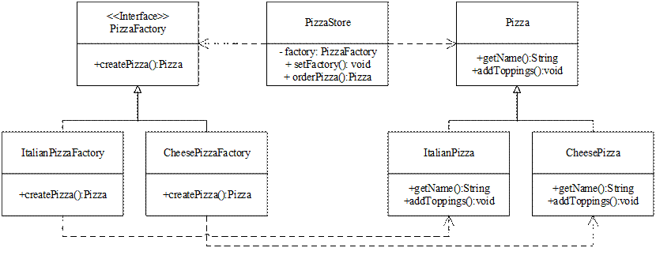

# 01

## 题目1：访问控制符的区别

文字题：描述Java中的访问控制符public、protected、private和默认（无修饰符）之间的主要区别，并解释它们在类成员访问权限上的作用。

编程题：编写一个Java类，包含一个private整数成员变量和一个public构造器，该构造器初始化变量，并提供一个protected方法来返回这个变量的值。

## 题目2：final关键字的用途

文字题：解释Java中final关键字的三种主要用途，并给出每种用途的简单代码示例。

## 题目3：static关键字的含义

文字题：阐述static关键字在Java中的含义，并讨论为什么一个静态方法不能访问类的实例变量或实例方法。

编程题：设计一个Java程序，包含一个static方法，该方法不接受任何参数，并打印出当前类的名称。

## 题目4：this和super关键字的区别

文字题：描述Java中this和super关键字的区别，并解释它们各自在什么场景下使用。

## 题目5：Java中的abstract和interface关键字

文字题：解释Java中的abstract关键字和interface关键字之间的主要区别，并讨论它们在面向对象编程中的作用。

编程题：创建一个Java接口，声明一个abstract方法calculateArea，然后在一个实现该接口的类中用final关键字实现这个方法。

## 题目6：Java中的synchronized关键字

文字题：synchronized关键字的含义

编程题：实现一个Java类，使用synchronized关键字同步一个方法，该方法内部生成一个随机数并打印。

## 题目7：Java中的volatile关键字

文字题：volatile关键字的含义

编程题：编写一个Java程序，包含一个类变量和一个实例变量，两者都使用volatile关键字修饰，并创建一个线程安全的计数器方法。

# 02

## 题目1：Java异常处理的理解

文字题：解释Java中的try、catch和finally块的作用及其在异常处理中的重要性。

编程题：编写一个Java程序，尝试打开并读取一个不存在的文件，并在catch块中处理FileNotFoundException，在finally块中释放资源。

## 题目2：Java Checked和Unchecked异常的区别

文字题：描述Java中Checked异常和Unchecked异常（运行时异常）之间的区别，并给出每种异常的一个例子。

编程题：创建一个方法，该方法接受一个整数数组并检查其中是否包含负数。如果包含，则抛出一个IllegalArgumentException（Checked异常），并在方法调用处进行处理。

## 题目3：Java异常链的理解

文字题：解释什么是Java异常链，并讨论在自定义异常时保留原始异常的原因。

编程题：编写一个自定义异常类MyCustomException，并在其构造器中接受另一个异常作为原因，并在抛出MyCustomException时，通过异常链传递原始异常。

## 题目4：Java中的throw和throws关键字

文字题：解释Java中throw和throws关键字的区别和用途。

编程题：编写一个方法，该方法接受一个字符串参数并检查是否为空。如果为空，则使用throw关键字抛出一个NullPointerException。

## 题目5：Java异常处理的最佳实践

文字题：讨论在Java异常处理中应遵循的最佳实践，包括何时捕获异常以及何时传播异常。

编程题：设计一个简单的银行账户类，包含存款和取款方法。在取款方法中，如果账户余额不足，则抛出一个InsufficientFundsException，并在主方法中处理这个异常。

# 03

## 题目1：Java继承的概念

文字题：解释Java中的继承是什么，并讨论它如何允许代码重用。

编程题：创建一个基类Animal和两个继承自Animal的子类Dog和Cat。每个类都有makeSound方法。

## 题目2：Java多态性的理解

文字题：描述Java中的多态性是什么，以及它如何影响方法调用。

编程题：扩展题目1，创建一个Animal数组，包含Dog和Cat对象，并调用每个对象的makeSound方法。

## 题目3：Java方法重写与重载

文字题：区分Java中的方法重写（Override）和重载（Overload）。

编程题：在Animal类中定义一个display方法，并在Dog和Cat类中重写这个方法。同时，在Animal类中重载display方法。

## 题目4：Java抽象类和接口

文字题：讨论Java中抽象类和接口的区别及其用途。

编程题：创建一个抽象类Shape，其中包含一个抽象方法draw。然后创建一个接口Colorable，包含一个方法setColor。实现这两个抽象概念的Circle类。

## 题目5：Java super关键字的使用

文字题：解释Java中super关键字的用途和它在继承中的作用。

编程题：创建一个基类Vehicle，包含一个startEngine方法。创建一个子类Car，它重写startEngine方法，并在其中使用super.startEngine()。

# 04

## 题目1：Java this 关键字的作用

文字题：解释Java中this关键字的用途和它在方法中如何引用当前对象。

编程题：创建一个名为Person的类，包含name和age属性，以及一个构造器和两个方法：getInfo()和updateAge(int age)。在getInfo()方法中使用this关键字来区分局部变量和成员变量。

## 题目2：Java参数传递机制

文字题：描述Java中参数传递是值传递还是引用传递，并举例说明。

编程题：编写一个方法swap，接受两个整数参数并交换它们的值，然后在主方法中测试这个方法。

## 题目3：Java方法重载

文字题：解释Java中方法重载是什么，以及它如何根据方法签名区分不同的方法。

编程题：在一个类Calculator中实现三个重载的add方法，分别接受两个整数、两个浮点数和三个整数作为参数。

## 题目4：Java方法重写

文字题：描述Java中方法重写的概念，并说明它与方法重载的区别。

编程题：创建一个基类Animal和一个子类Bird，重写Animal类中的makeSound方法。

## 题目5：Java this 关键字与构造器

文字题：讨论在Java构造器中使用this关键字调用另一个构造器的目的和语法。

编程题：设计一个Car类，包含model、year和color属性，以及使用this关键字链式调用的多个构造器。

# 05

## 题目1：抽象类和接口的区别

文字题：解释Java中抽象类和接口的主要区别，并讨论它们各自适用的场景。

编程题：创建一个抽象类Shape，包含一个抽象方法draw()，然后创建两个子类Circle和Rectangle实现这个抽象方法。

## 题目2：抽象类中成员变量的访问

文字题：讨论在抽象类中是否可以有非抽象方法和实例变量，并解释它们如何在子类中被访问。

编程题：设计一个抽象类Vehicle，其中包含一个实例变量wheels和一个非抽象方法startEngine()。创建一个子类Car继承Vehicle并重写startEngine()方法。

## 题目3：抽象类与构造器

文字题：解释为什么抽象类不能被实例化，以及是否可以为抽象类提供构造器。

编程题：编写一个抽象类Animal，包含一个构造器和一个抽象方法makeSound()。创建一个子类Dog继承Animal并实现makeSound()方法。

## 题目4：抽象类与多态

文字题：描述如何通过抽象类实现多态，并讨论它在设计模式中的应用。

编程题：创建一个抽象类Painter，包含一个抽象方法paint()。创建两个子类HousePainter和CarPainter实现paint()方法。编写一个方法paintObject(Painter painter)，接受Painter对象并调用paint()方法。

## 题目5：抽象类与方法重写

文字题：讨论在抽象类中重写方法与在普通类中重写方法的区别和注意事项。

编程题：设计一个抽象类MusicPlayer，包含一个抽象方法play()。创建一个子类MP3Player重写play()方法，并在主方法中创建MP3Player对象并调用play()方法。

# 06

## 题目1：Java局部变量的作用域

文字题：描述Java中局部变量的作用域是什么，并说明它们何时被初始化。

编程题：编写一个方法，该方法接受两个整数参数并返回它们的和。讨论局部变量a和b的作用域。

## 题目2：Java实例变量和类变量的作用域

文字题：区分Java中的实例变量和类变量，并解释它们各自的作用域。

编程题：创建一个类Counter，包含一个实例变量count和一个类变量total。编写方法来增加count和total的值，并在主方法中演示它们的作用域。

## 题目3：Java代码块作用域

文字题：解释Java中代码块作用域是什么，并给出一个代码块作用域的例子。

编程题：在一个类中创建一个静态代码块和一个实例代码块，并在其中初始化类变量和实例变量。讨论这些变量的作用域。

## 题目4：Java方法参数的作用域

文字题：描述Java中方法参数的作用域，并讨论它们与局部变量的关系。

编程题：编写一个方法，该方法接受一个字符串参数，并在方法内部创建一个同名的局部变量。讨论参数和局部变量的作用域和关系。

## 题目5：Java中this和super关键字与作用域

文字题：解释Java中this和super关键字如何影响成员变量和方法的作用域。

编程题：创建一个基类Person和一个子类Employee。在Person类中定义一个getName()方法，在Employee类中重写这个方法，并使用super.getName()来调用基类方法。讨论this和super如何影响方法调用。

# 07

## 题目1：Java接口的多实现

文字题：解释为什么一个Java接口可以被多个类实现，并讨论这种设计的好处。

编程题：定义一个接口Flyable，包含一个方法fly()。创建两个类Bird和Airplane实现这个接口，并在主方法中创建它们的实例，调用fly()方法。

## 题目2：Java默认方法

文字题：描述Java 8中引入的默认方法是什么，以及它们如何影响接口的实现。

编程题：在一个接口Chargeable中定义一个默认方法charge()。实现这个接口，并在实现类中覆盖这个方法。

## 题目3：Java接口与抽象类的区别

文字题：讨论Java接口和抽象类的主要区别，并给出使用场景的例子。

编程题：创建一个接口Printable，包含一个方法print()。创建一个抽象类Document也包含一个方法print()。实现Printable接口和继承Document的两个不同类。

## 题目4：Java接口中的静态方法

文字题：解释Java接口中可以包含静态方法，并讨论它们如何被调用。

编程题：在一个接口Calculator中定义一个静态方法add(int a, int b)。在主方法中调用这个静态方法。

## 题目5：Java接口作为参数传递

文字题：讨论将接口作为参数传递的好处，并给出一个实际的应用场景。

编程题：定义一个接口RunnableTask，包含一个方法run()。实现这个接口，并创建一个方法executeTask(RunnableTask task)，它接受RunnableTask接口作为参数并执行run()方法。

# 08

## 题目1：Java中子类的构造方法如何调用父类的构造方法

文字题：解释Java中子类的构造方法如何调用父类的构造方法，以及super关键字的作用。

编程题：创建一个基类Vehicle和一个子类Car。Vehicle有一个构造器，接受一个品牌参数。Car也有一个构造器，接受一个品牌和一个型号参数。在Car的构造器中调用Vehicle的构造器。

## 题目2：Java中子类构造方法和父类成员变量的初始化顺序

文字题：描述Java中子类构造方法执行时，父类成员变量和子类成员变量的初始化顺序。

编程题：创建一个基类Animal和一个子类Dog。Animal有一个成员变量name和一个构造器。Dog也有一个成员变量breed和一个构造器。展示在创建Dog对象时成员变量的初始化顺序。

## 题目3：Java中无参构造方法的调用

文字题：讨论Java中子类构造方法如果不显式调用父类构造方法，将会发生什么。

编程题：创建一个基类Shape和一个子类Circle。Shape有一个无参构造方法，打印一条消息。Circle有一个构造器，不显式调用Shape的构造器。创建Circle对象并观察输出。

## 题目4：Java中构造方法和this关键字的使用

文字题：解释Java中this关键字在构造方法中的作用，以及如何使用它调用当前类的其他构造方法。

编程题：创建一个类Book，包含两个构造器。一个接受书名和作者，另一个接受书名、作者和出版年份。使用this关键字在这两个构造器之间进行调用。

## 题目5：Java中父类构造方法的调用时机

文字题：讨论在Java中父类的构造方法在子类构造过程中何时被调用。

编程题：创建一个基类Person和一个子类Employee。Person有一个构造器，接受一个名字参数。Employee有一个构造器，接受一个名字和一个员工ID参数。在Employee的构造器中调用Person的构造器，并讨论调用时机。

# 09

## 题目1：Java静态方法和非静态方法的区别

文字题：解释Java中静态方法和非静态方法的主要区别，包括它们在调用和使用上的差异。

编程题：创建一个类MathUtils，包含一个静态方法add(int a, int b)和一个非静态方法subtract(int a, int b)。在主方法中调用这两个方法，并解释调用方式的不同。

## 题目2：静态方法访问类成员

文字题：讨论为什么静态方法不能直接访问类的非静态成员变量和非静态方法。

编程题：创建一个类Person，包含一个非静态成员变量name和一个静态方法printName(String name)。展示如何在静态方法中访问非静态成员变量。

## 题目3：静态方法与构造器

文字题：解释Java中静态方法是否可以调用构造器，以及构造器是否可以调用静态方法。

编程题：创建一个类Product，包含一个静态方法loadConfig()和一个构造器。在构造器中调用loadConfig()方法，并在静态方法中创建Product对象。

## 题目4：静态方法与类变量

文字题：描述静态方法如何访问和操作类变量，并讨论它们在单例模式中的应用。

编程题：设计一个单例类DatabaseConnection，包含一个类变量instance和一个静态方法getInstance()。确保getInstance()方法返回类的唯一实例。

## 题目5：静态方法的继承和重写

文字题：讨论Java中静态方法是否可以被继承和重写，并解释为什么。

编程题：创建一个基类Shape和一个子类Circle。Shape类包含一个静态方法calculateArea()。在Circle类中重写这个方法，并在主方法中调用这两个方法。

# 10

## 题目1：Java异常层次结构

文字题：描述Java异常层次结构的根类是什么，并解释检查型异常和非检查型异常的区别。

编程题：编写一个Java程序，尝试打开一个不存在的文件，并捕获并处理FileNotFoundException（检查型异常）。

## 题目2：Java RuntimeException

文字题：解释Java中RuntimeException是什么，并给出几个继承自它的常见异常的例子。

编程题：编写一个方法，当传入的整数数组包含负数时，抛出IllegalArgumentException，并在主方法中测试这个行为。

## 题目3：Java finally块的作用

文字题：讨论Java中finally块的重要性以及它在异常处理中的作用。

编程题：编写一个Java程序，演示在try-catch块中打开一个资源，并在finally块中确保资源被关闭。

## 题目4：Java自定义异常

文字题：解释何时应该创建自定义异常，并讨论自定义异常的命名约定。

编程题：创建一个自定义异常InvalidAgeException，并在处理用户年龄输入时抛出这个异常。

## 题目5：Java异常链

文字题：解释Java异常链的概念，并讨论它在调试异常时的好处。

编程题：编写一个方法，该方法接受一个文件路径作为参数，并在尝试打开文件时捕获IOException，同时将原始异常作为新异常的cause抛出。

# 11

## 题目1：方法重写与方法签名

文字题：阐述在Java中方法重写需要满足哪些条件，并解释方法签名的含义。

编程题：定义一个基类Animal和一个子类Dog。在Animal类中定义一个方法makeSound()，然后在Dog类中重写这个方法。

## 题目2：重写与访问控制

文字题：讨论在子类中重写父类方法时，如何通过访问控制符影响方法的可见性。

编程题：创建一个基类Vehicle，其中包含一个startEngine()方法。然后创建一个子类Car，重写startEngine()方法，并尝试降低访问级别。

## 题目3：重写与协变返回类型

文字题：解释Java中的协变返回类型是什么，并讨论它与方法重写的关系。

编程题：定义一个基类Shape和一个子类Circle。Shape类包含一个返回Shape类型的方法clone()。在Circle类中重写这个方法，使其返回Circle类型。

## 题目4：重写与静态方法

文字题：讨论为什么静态方法不能被重写，并解释它们在继承中的行为。

编程题：创建一个基类MathUtils，其中包含一个静态方法add(int a, int b)。尝试在子类AdvancedMath中重写这个方法。

## 题目5：重写与构造方法

文字题：解释为什么构造方法不能被重写，并讨论子类构造方法与父类构造方法的关系。

编程题：创建一个基类Person和一个子类Student。Person类有一个接受名字的构造方法。在Student类中提供一个构造方法，它除了接受名字外还接受一个学号，并在Student的构造方法中调用Person的构造方法。

# 12

## 题目1：基本类型与包装类的转换

文字题：解释Java中基本数据类型和它们的包装类之间如何进行自动装箱和拆箱。

编程题：编写一个Java程序，将Integer对象转换为int基本类型，并演示自动拆箱的过程。

## 题目2：对象的向上转型和向下转型

文字题：讨论Java中对象的向上转型和向下转型的区别，并解释何时需要强制类型转换。

编程题：创建一个基类Animal和两个子类Dog和Cat。编写代码演示如何将Animal类型的对象向下转型为Dog类型。

## 题目3：多态与类型转换

文字题：解释在多态的情况下，为什么可能需要进行强制类型转换，并讨论其安全性。

编程题：创建一个方法，接受Animal类型的参数并调用一个makeSound方法。在子类中重写这个方法，并在主方法中演示如何调用子类的特定实现。

## 题目4：数组与泛型的类型转换

文字题：讨论Java中数组的协变返回类型，并解释为什么数组不能进行泛型的协变。

编程题：编写一个泛型方法，返回一个泛型类型的数组，并尝试将返回值转换为特定类型的数组。

## 题目5：强制类型转换与异常

文字题：解释在Java中进行强制类型转换时可能抛出的异常，并讨论如何安全地进行类型转换。

编程题：编写一个程序，尝试将一个Object类型的变量强制类型转换为String，并处理可能出现的ClassCastException。

# 13

## 题目1：线程间通信

文字题：解释Java中线程间如何进行通信，并讨论wait()、notify()和notifyAll()方法的作用。

编程题：创建两个线程，一个生产者线程和一个消费者线程，使用一个共享资源（如一个整数）。生产者线程增加共享资源的值，消费者线程减少它的值。确保线程间正确通信，避免数据不一致。

## 题目2：死锁

文字题：讨论Java中死锁的概念，并解释如何避免死锁。

编程题：编写一个程序，创建两个线程，每个线程尝试锁定两个资源（如两个不同的对象）。设计程序使得这两个线程能够产生死锁，并展示如何避免这种情况。

## 题目3：线程池的使用

文字题：解释Java中线程池的作用，并讨论它如何提高性能。

编程题：实现一个简单的线程池，允许提交一定数量的任务，并使用固定数量的工作线程来执行这些任务。

## 题目4：Callable和Future

文字题：讨论Java中Callable接口与Runnable接口的区别，并解释Future对象的作用。

编程题：使用ExecutorService创建一个线程池，并提交一个Callable任务。获取与Callable任务关联的Future对象，并在主线程中获取任务结果。

## 题目5：原子变量和可见性

文字题：解释Java中原子变量的作用，并讨论它们如何保证线程间操作的原子性和可见性。

编程题：创建一个多线程程序，其中一个线程更新一个共享计数器，而另一个线程读取这个计数器。使用AtomicInteger来确保更新对所有线程都是可见的，并且是原子操作。

# 14

## 题目1：Java异常处理基础

文字题：描述Java中异常处理的必要性，并解释try、catch、finally块的作用。

编程题：编写一个Java程序，尝试解析用户输入的整数，并处理可能发生的NumberFormatException。

## 题目2：Java自定义异常

文字题：解释何时需要创建自定义异常，并讨论自定义异常与标准异常的区别。

编程题：创建一个自定义异常InvalidDataException，并在处理特定业务逻辑时抛出此异常。

## 题目3：Java异常链

文字题：讨论Java异常链的概念，并解释它如何帮助调试。

编程题：编写一个方法，该方法打开一个文件并读取内容。在捕获IOException的同时，将原始异常包装在新的异常中抛出。

## 题目4：Java Checked和Unchecked异常

文字题：解释Java中Checked异常和Unchecked异常的区别，并讨论它们在程序设计中的使用场景。

编程题：编写一个程序，该程序包含一个可能抛出Checked异常的方法，并在调用处适当处理这个异常。

## 题目5：Java finally块与资源释放

文字题：讨论Java中finally块的重要性，特别是在资源管理（如关闭文件流）中的应用。

编程题：编写一个Java程序，使用try-catch-finally块打开和关闭文件。确保即使在发生异常的情况下，文件也能被正确关闭。

# 15

## 题目1：抽象类的应用

文字题：解释抽象类在Java中的作用以及它们如何帮助实现代码的抽象化和模块化。

编程题：设计一个抽象类Shape，包含一个抽象方法calculateArea()，然后创建两个子类Circle和Rectangle实现这个抽象方法。

## 题目2：泛型类和泛型接口的使用

文字题：讨论Java中泛型类和泛型接口的优势，特别是在编写集合类时。

编程题：创建一个泛型类Box<T>，它包含一个泛型类型T的私有成员变量，并提供相应的getter和setter方法。然后创建一个泛型接口ComparableBox<T>，其中包含一个比较两个泛型类型对象的方法。

## 题目3：集合框架的应用

文字题：描述Java集合框架中List、Set和Map接口的主要区别和用途。

编程题：编写一个程序，使用Java集合框架实现一个简单的电话簿，允许添加、删除和查找联系人信息。

## 题目4：设计模式的实现

文字题：解释单例模式和工厂模式在软件开发中的应用场景和优缺点。

编程题：实现单例模式，创建一个DatabaseConnection类，确保只能创建一个数据库连接实例。然后实现工厂模式，创建一个ShapeFactory类，用于生成不同类型的Shape对象。

## 题目5：方法重写和方法重载

文字题：区分Java中方法重写（Override）和方法重载（Overload），并讨论它们在面向对象编程中的作用。

编程题：创建一个类Calculator，包含方法add(int a, int b)和add(double a, double b)，展示方法重载。然后在子类ScientificCalculator中重写add方法，添加额外的功能。

# 16

## 题目1：接口的多实现

文字题：解释为什么一个Java接口可以被多个类实现，并讨论这种设计的好处。

编程题：定义一个接口Flyable，包含一个方法fly()。创建两个类Bird和Airplane实现这个接口，并在主方法中创建它们的实例，调用fly()方法。

## 题目2：多态性的应用

文字题：描述Java中多态性的概念，并给出多态在方法调用中如何工作的示例。

编程题：创建一个基类Animal和一个子类Dog。Animal类有一个方法makeSound()，在Dog类中重写这个方法。创建一个Animal数组，包含Dog对象，并调用makeSound()方法。

## 题目3：组合/聚合关系

文字题：区分Java中的组合（Composition）和聚合（Aggregation）关系，并讨论它们在对象设计中的使用场景。

编程题：设计一个Car类，其中包含Engine类的实例作为属性（组合关系）。同时设计一个TrafficLight类，其中包含Car类的集合作为属性（聚合关系）。展示这两种关系在代码中的实现。

## 题目4：UML图与类图

文字题：解释UML类图是什么，以及它如何帮助软件开发者理解和设计系统。

编程题：根据以下描述绘制一个UML类图：一个Library类包含Book类的集合，Book类有一个String类型的title属性和一个printInfo()方法。Library类有一个checkOutBook(Book book)方法。

## 题目5：接口与抽象类的区别

文字题：讨论Java接口和抽象类的主要区别，并给出使用场景的例子。

编程题：创建一个抽象类Shape，包含一个抽象方法draw()。然后创建一个接口Colorable，包含一个方法setColor(String color)。实现这两个抽象概念的Circle类，它既是一个Shape也是一个Colorable。

# 练习

## 1、模拟电梯控制系统

要求：

设计一个抽象类 ElevatorButton，该类定义了一个抽象方法 pressButton()，用于模拟按钮的按下操作。

创建三个子类：

UpButton：模拟上楼按钮，按下时打印“上楼按钮被按下”。
DownButton：模拟下楼按钮，按下时打印“下楼按钮被按下”。
StopButton：模拟停止按钮，按下时打印“停止按钮被按下”。
设计一个控制器类 ElevatorController，该类需要实现以下功能：

pressButton(ElevatorButton... buttons)：一个方法，使用可变参数（Varargs），接收多个电梯按钮，并依次调用每个按钮的 pressButton() 方法。
pressButton(int buttonCount)：另一个重载方法，接收一个 int 参数，表示按钮的数量（假设只有上楼按钮），创建多个上楼按钮，并依次按下。
创建一个测试类 ElevatorSimulation，在其中实现 main() 方法。测试类中需要：

创建 UpButton、DownButton 和 StopButton 对象，并通过 ElevatorController 控制模拟按键过程。
使用 pressButton(int buttonCount) 方法来模拟多个上楼按钮按下的场景。

## 2、模拟交替打印数字 1、2、3、4，要求打印出 1234, 12341234, 123412341234, …。

要求：

创建四个线程：

第一个线程打印数字 1。
第二个线程打印数字 2。
第三个线程打印数字 3。
第四个线程打印数字 4。
这四个线程需要交替打印，每次按顺序打印 1234。比如，第一次打印 1234，第二次打印 12341234，第三次打印 123412341234，如此循环。

使用一个锁和一个状态变量来控制线程的顺序执行，保证四个线程按顺序交替执行。并且打印的结果是连贯的。

## 3、设计一个简易的学生成绩管理系统

要求：

创建一个 StudentGradeManager 类，具备以下功能：
addGrade(String studentName, double grade)：为指定学生添加成绩。成绩必须在 0 到 100 之间，若不在范围内抛出 IllegalArgumentException 异常。
getAverageGrade()：计算所有学生的平均成绩。
getHighestGrade()：返回所有学生的最高成绩。
getPassedStudents()：返回所有及格（成绩大于等于 60）的学生名单。
创建一个 StudentGradeManagerTest 类，包含一个 main 方法用于测试 StudentGradeManager 的功能。
在 main 方法中，创建 StudentGradeManager 对象，模拟添加学生成绩、计算平均分、获取最高分以及获取及格学生名单的操作。
使用 try-catch 块来捕获并处理 IllegalArgumentException 异常，并打印出相应的错误信息。

# 练习

## **3.1** 设计一个Java程序，模拟一个交通信号灯的运行过程。程序需要展示方法的重载和重写。具体要求如下：

创建一个名为 TrafficLight 的抽象基类，包含一个抽象方法 changeLight()，用于模拟信号灯的变化。

创建三个类 RedLight、YellowLight 和 GreenLight，它们都继承自 TrafficLight 类，并重写 changeLight() 方法。每个类应该模拟对应颜色的信号灯，并打印出信号灯的状态。

在 RedLight 类中，changeLight() 方法应该打印出 “红灯亮起，停车” 的信息。

在 YellowLight 类中，changeLight() 方法应该打印出 “黄灯亮起，准备起步” 的信息。

在 GreenLight 类中，changeLight() 方法应该打印出 “绿灯亮起，可以通行” 的信息。

创建一个名为 TrafficController 的类，包含以下方法：

controlLights(TrafficLight... lights)：一个重载方法，接受可变数量的 TrafficLight 对象作为参数，并依次调用每个信号灯的 changeLight() 方法。

controlLights(int lightCount)：一个重载方法，接受一个 int 类型的参数，表示信号灯的数量，并创建相应数量的 GreenLight 对象（假设只有绿灯），然后依次调用每个信号灯的 changeLight() 方法。

创建一个名为 TrafficSimulation 的测试类，包含 main 方法用于测试交通信号灯模拟功能。在 main 方法中，创建 RedLight、YellowLight 和 GreenLight 对象，并调用 TrafficController 的方法来模拟信号灯的变化。同时，测试 controlLights(int lightCount) 方法，模拟只有绿灯的情况。

 

 

## **3.2** 4个线程，一个线程打印Y，一个线程打印O，一个线程打印L，一个线程打印O，四个线程同时执行，要求打印出5个连着的YOLO, YOLOYOLO, … 。通过一个锁和一个状态变量来实现。

 

 

## **3.3** 设计一个Java程序，实现一个简易的数学计算器，该计算器能够执行加、减、乘、除四种基本运算。程序需要处理可能出现的异常情况，并给出相应的错误提示。具体要求如下：

创建一个名为 SimpleCalculator 的类，包含以下方法：

add(double a, double b)：加法方法，返回两个数的和。

subtract(double a, double b)：减法方法，返回两个数的差。

multiply(double a, double b)：乘法方法，返回两个数的乘积。

divide(double a, double b)：除法方法，返回两个数的商。如果除数为0，抛出 ArithmeticException。

创建一个名为 CalculatorTest 的类，包含一个 main 方法用于测试计算器功能。在 main 方法中，创建 SimpleCalculator 对象，并模拟加、减、乘、除的操作。确保测试用例中包含正常情况和异常情况。在 CalculatorTest 类中，使用 try-catch 块来捕获并处理 ArithmeticException 异常，并打印出相应的错误信息。

 

 

## **4.1**设计一个Java程序，实现一个动物园管理系统，该系统需要支持多种动物的添加、喂养和声音模拟，并且能够根据不同的动物类型进行特定的喂养策略。

要求如下：

（1）创建一个动物（Animal）基类，包含一个名为makeSound的抽象方法，用于模拟动物发出声音。

创建两个继承自动物类的子类：狗（Dog）和猫（Cat），它们分别重写makeSound方法，并添加一个getFoodType方法，返回动物的食物类型。

创建一个泛型接口Feedable<T>，其中T是动物类型，包含一个名为feed的方法，用于喂养动物。

创建一个泛型类Zoo<T extends Animal>，它包含一个泛型列表List<T>来存储动物，并实现Feedable<T>接口。

在Zoo类中实现feed方法，该方法接受一个动物类型的参数，并调用其makeSound方法和getFoodType方法，根据食物类型进行特定的喂养。

创建一个Food类，包含食物名称和营养值属性，以及一个feedAnimal方法，用于喂养动物并输出喂养信息。

创建一个FoodFactory类，包含一个静态方法getFood，根据传入的食物类型返回对应的Food对象。

（2）编写一个测试类，创建Zoo对象，并添加不同类型的动物，然后测试喂养它们，并验证食物类型是否正确。

 

 

## **4.2**设计一个披萨店点餐系统，支持不同类型的披萨（如意式披萨、奶酪披萨），每种披萨具有添加配料的功能，披萨店通过工厂方法动态创建披萨，系统的UML图如下，完成要求：

 

**1)** **实现披萨类及其子类**，定义一个抽象类 Pizza，包含方法：String getName()、void addToppings()。实现披萨类：ItalianPizza、CheesePizza

**2)** **实现披萨工厂接口及其子类**，定义一个接口 PizzaFactory，包含方法：Pizza createPizza()。

实现以下工厂类：ItalianPizzaFactory、CheesePizzaFactory。

**3)** **实现披萨店点餐逻辑**，定义一个类 PizzaStore，包含方法：void setFactory(PizzaFactory factory)、Pizza orderPizza()。 

**4)** **在** **main** **方法中**：点一份意式披萨，输出其信息；点一份奶酪披萨，输出其信息。

可供参考的类/方法的作用如下：“

| **类/方法名**                               | **类/方法的作用**                                       |
| ------------------------------------------- | ------------------------------------------------------- |
| 方法 String getName()                       | 返回披萨的名称                                          |
| 方法 void addToppings()                     | 打印添加的配料信息                                      |
| 类 ItalianPizza                             | 返回 "Italian  Pizza"，  配料为 "Add tomato and  basil" |
| 类 CheesePizza                              | 返回 "Cheese  Pizza"，  配料为 "Add mozzarella  cheese" |
| 类 Pizza createPizza()                      | 用于创建披萨对象                                        |
| 类 ItalianPizzaFactory                      | 返回 ItalianPizza                                       |
| 类 CheesePizzaFactory                       | 返回 CheesePizza                                        |
| 方法 void  setFactory(PizzaFactory factory) | 设置披萨工厂                                            |
| 方法 Pizza orderPizza()                     | 使用工厂创建披萨、添加配料、返回披萨对象。              |

 